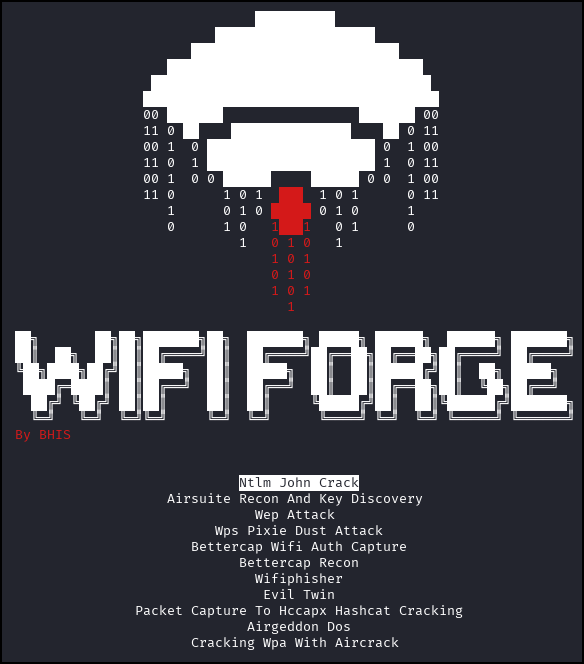
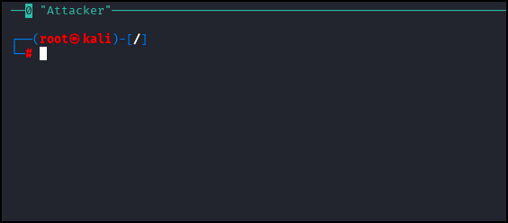
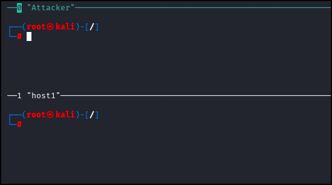

**Estimated Time:** ~10-15 minutes

## Summary
In this lab we will learn how to navigate the tool **WifiForge**. WifiForge is a framework built on top of the open source software [Mininet-WiFi](https://mininet-wifi.github.io) that provides *virtual* Wi-Fi labs! The labs in this course teach a variety of common Wi-Fi hacking concepts. 

## Installation
Follow the [Installation instructions](../Installation.md) to get WifiForge installed on your system. It is recommended to use the Docker method from a compatible host operating system or virtual machine.

## Navigating the Main Menu
Follow the steps in the [installation guide](../Installation.md) to launch WifiForge. Once running you should see the following menu: 



If this menu is not present on your machine, launch WifiForge with the following command. If the command does not work - ask for help.

```
sudo python3 /WifiForge/WifiForge.py
```

Use the **\[UP]** and **\[DOWN]** arrow keys to navigate the menu. Press **\[ENTER]** to select a lab. After selecting a lab, allow for up to 30 seconds for the network to build. When finished, your screen will appear similar to the following: 



This is the interface you will have to work with for the majority of labs. Note the name of the node (Attacker) in the upper left hand corner of the terminal window. This is the name of a simulated machine on the network. The attacking machine is always called "Attacker" and will normally be the only machine you interact with. However, a handful of labs may require you to simulate user behavior or have multiple terminals on the same machine. In these cases, you will be provided with a multi-pane view similar to the one below: 


*The active pane is highlighted with a green border. In the above example the Attacker pane has focus.*

Note here that the screen allows access to two different hosts: your attacking machine "**Attacker**" and one victim "**host1**". You can access the terminals of each of these machines by clicking within the pane that represents the host you want to interact with.

## Done with the Lab?
To exit a lab, simply type ```main_menu``` into any of the terminal panes to return to the main menu.

## Lab Complete
Congratulations! You have successfully completed Lab 00. You now understand:
- How to navigate the WifiForge framework
- The basic interface and terminal structure
- How to switch between different host terminals
- How to exit labs and return to the main menu

This foundational knowledge will be essential for all subsequent labs.

---
**NEXT LAB:** [Lab 01 - Bettercap Recon](Lab%2001%20-%20Bettercap%20Recon.md)