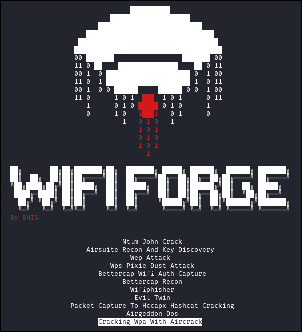
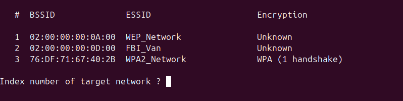
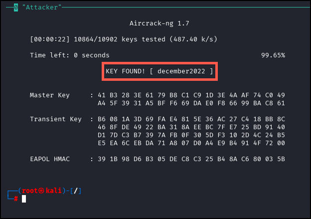

**Estimated Time:** ~10-15 minutes  

## Summary
Use aircrack-ng to crack WPA handshakes captured in previous labs using dictionary-based password attacks.

Select "Cracking WPA with Aircrack" from the main menu. Allow up to 30 seconds to initialize the network. 



A single attacker window will appear in your terminal. 

Run the following command in this terminal to crack the key associated with the WPA handshake collected from the bettercap lab. 

```
aircrack-ng -w /WifiForge/framework/lab_materials/rockyou.txt /WifiForge/Framework/loot/4whs
```

If your capture file contains multiple networks, aircrack will find all the networks in the capture and ask which network the hash is associated with. Input the number associated with the WPA2_Network and hit enter if you are prompted.



Allow for up to 30 seconds for the password to be revealed.



You now are familiar with two different methods to collect and crack WPA2 keys. Use the `main_menu` command to return to the main menu and onto the next lab. 

## Lab Complete
Congratulations! You have successfully completed Lab 05. You now understand:
- Using aircrack-ng for WPA handshake analysis
- Dictionary-based password cracking techniques
- Working with previously captured handshake files
- Multiple network selection in capture files

---
**PREVIOUS LAB:** [Lab 04 - Airsuite Tools - Recon and Pre-Shared Key Recovery](Lab%2004%20-%20Airsuite%20Tools%20-%20Recon%20and%20Pre-Shared%20Key%20Recovery.md)  
**NEXT LAB:** [Lab 06 - Airgeddon Denial of Service Beacon Attacks](Lab%2006%20-%20Airgeddon%20Denial%20of%20Service%20Beacon%20Attacks.md)

