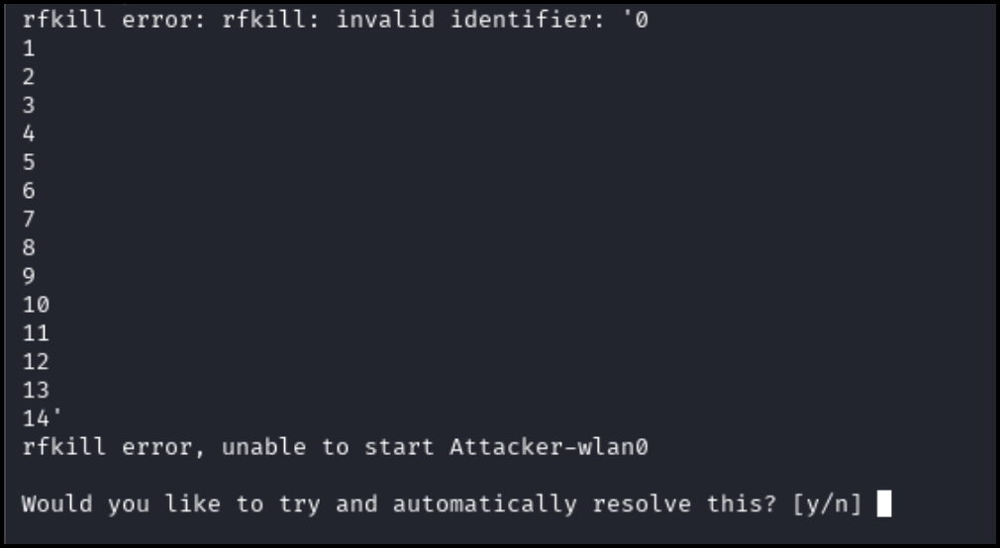
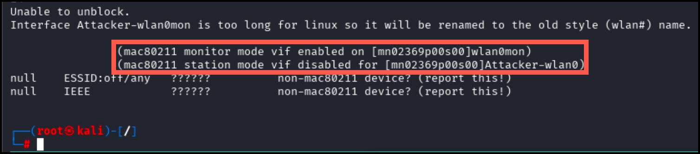
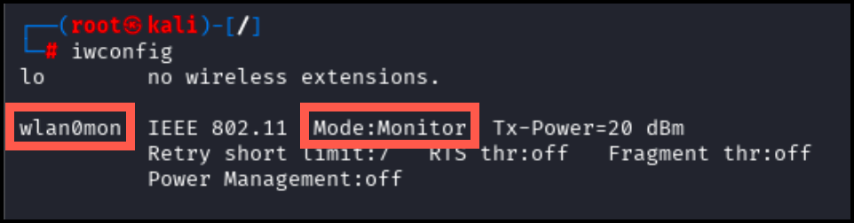

# Currently doesn't work 

**Estimated Time:** ~25-30 minutes

## Summary
Exploit WPS (Wi-Fi Protected Setup) vulnerabilities using Reaver to bypass WPA2 security through PIN attacks.

## Getting Started

Select "WPS Pixie Dust Attack" from the menu. Allow up to 30 seconds to initialize the network. 


An Attacker and a host1 panel will appear in your terminal. Select the Attacker pane for the following commands.

Start by putting the interface `Attacker-wlan0` in monitor mode.

```bash
airmon-ng start Attacker-wlan0
```

If the following prompt appears, input "**y**" and hit enter. 



Successful initialization will appear as pictured below:



Verify that the interface has been put into monitor mode using the following command. Look for `Mode:Monitor`:

```bash
iwconfig
```

As pictured below, the interface `wlan0mon` should now be present in monitor mode.



Run the follow command to start the attack from the Attacker pane. 

```
wifite --wps
```

Select the `Attacker-wlan0` interface.

The above command may take a moment to locate the network. Wait until the network secure_wifi has been located as seen below. 

Pr\[CTRL + c] to continue. A prompt will appear asking which network should be targeted. Only one option should be present; input 1 to select it.

UU

Wifite will attempt a series of WPS attacks and reveal the PIN. 

UU

Use the main_menu command to return to the main menu and onto the next lab. 

## Lab Complete
Congratulations! You have successfully completed Lab 10. You now understand:
- WPS vulnerability assessment and exploitation
- Using Wifite for automated wireless attacks
- PIN-based WPS attacks and weaknesses
- Bypassing WPA2 security through WPS flaws

---
**PREVIOUS LAB:** [Lab 09 - Rogue AP with Wifiphisher](Lab%2009%20-%20Rogue%20AP%20with%20Wifiphisher.md)  
**NEXT LAB:** [Lab 11 - WEP Key Cracking](Lab%2011%20-%20WEP%20Key%20Cracking.md)

