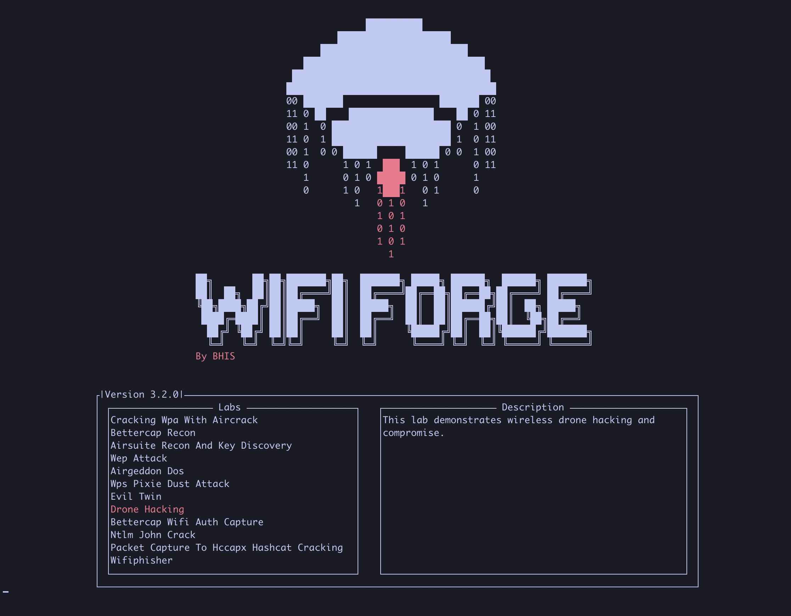
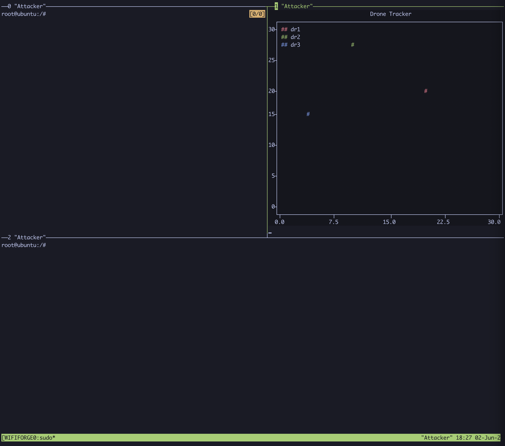
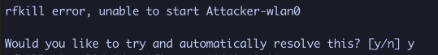
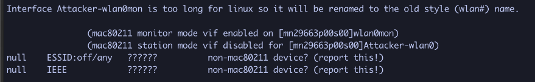
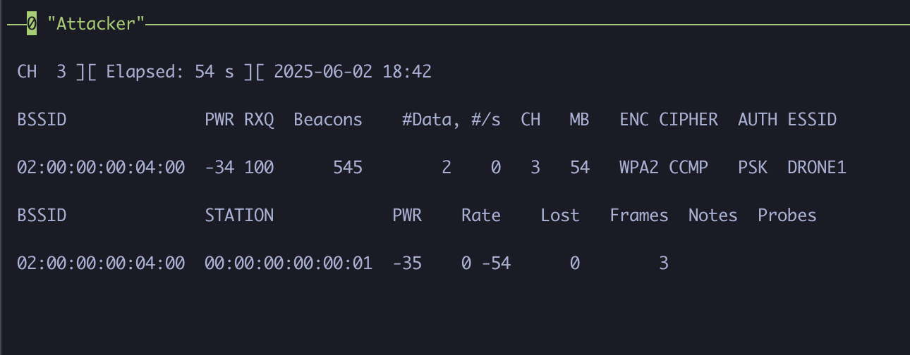
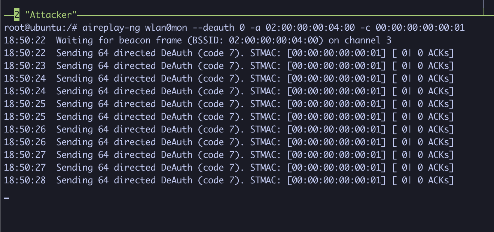
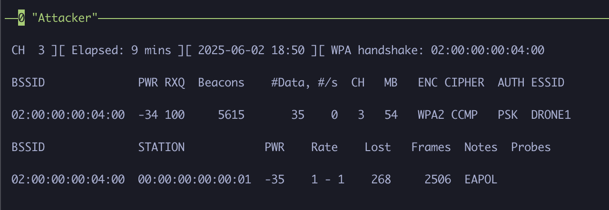
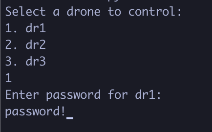
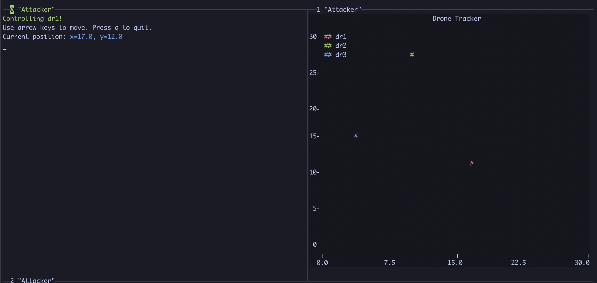

Select `Drone Hacking` from the menu. Allow a few seconds to initialize the network.

Once complete, a tmux session will start with three panes.

Feel free to resize the pane by dragging the borders around and start the graph that tracks drone positions by typing:

`python3 WifiForge/framework/lab_materials/graph-drones.py`

In another pane, set your wireless interface to monitor mode. First, identify the interface name by typing:

`iwconfig`

For this example, the interface name is `Attacker-wlan0`.

After noting the interface name, start monitor mode by typing:

`airmon-ng start Attacker-wlan0`

If prompted to automatically resolve any issues, type "y" and hit enter.

Verify the interface is now in monitor mode by running `iwconfig` again. The interface should be renamed to `wlan0mon`, and its `Mode:` should be set to `Monitor`.

With the device in monitor mode, run the following to scan for nearby wireless networks:

`airodump-ng wlan0mon`

We can see two drones are active, each with its own dedicated network. For demonstrative purposes, we’ll target the `DRONE1` network and attempt to capture its WPA2 handshake. To focus on the target network specifically, note the channel number and the BSSID of the device. In the case of `DRONE1`, we have the following:

- Channel number: `3`
- BSSID: `02:00:00:00:04:00`

Type `ctrl+c` to kill the current `airodump-ng` instance and type the following command, where:

- `-c` specifies the channel
- `--bssid` specifies the BSSID of the device,
- `-w` outputs the capture to a file, called `drone1` in our case.

`airodump-ng wlan0mon -c 3 --bssid 02:00:00:00:04:00 -w drone1`

We can also see that a client (station) device is actively connected to the network with the MAC address of `00:00:00:00:00:01`!

In the third pane, we’ll launch a deauthentication attack on the `DRONE1` network. This will force the client to reauthenticate, initiating the four-way WPA2 handshake, which we can capture to later crack the password.

Type the following command, where:

- `--deauth 0` indicates deauthentication frames will be sent with no limit (0),
- `-a` is the access point MAC address (BSSID),
- and `-c` is the client (station) MAC address.

`aireplay-ng wlan0mon --deauth 0 -a 02:00:00:00:04:00 -c 00:00:00:00:00:01`

When you see `WPA handshake: <MAC_address>` appear in the `airodump-ng` window, stop both the deauth attack and capture process by pressing `ctrl+C` in their respective panes.

Now let’s crack the WPA2 password! First, ensure that a capture file (`.cap`) was created.

If you have the `.cap` file, use `aircrack-ng` with a wordlist to attempt password recovery:

`aircrack-ng -w /WifiForge/framework/lab_materials/rockyou.txt ./<drone-file>.cap`

Give it a little bit of time, and eventually the password should be revealed!

Now that we've recovered the password, let's control the compromised drone! To run the controller, type:

`python3 /WifiForge/framework/lab_materials/control-drones.py`

Each drone will be password protected, so make sure to select the drone that was successfully compromised. In our case, we compromised `DRONE1`, so we will select `dr1` and enter its password.

If successful, you should be greeted with a `Controlling <drone_name>!` message. Move the drone around with the arrow keys and watch the drone move around on the graph!

When done, press `q` to exit the drone controller, and repeat the steps to compromise the remaining drones.
