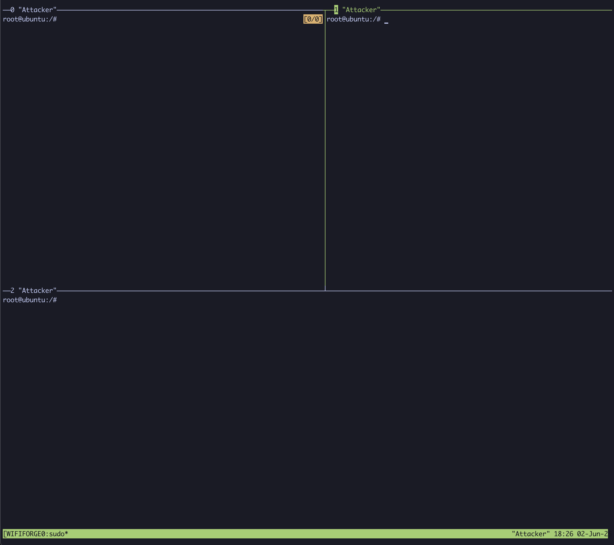
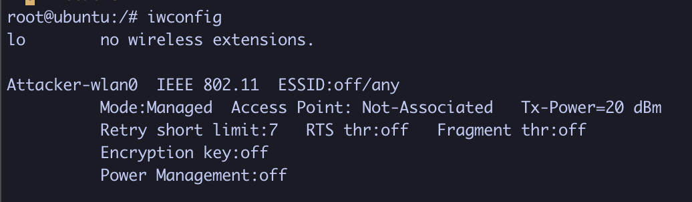
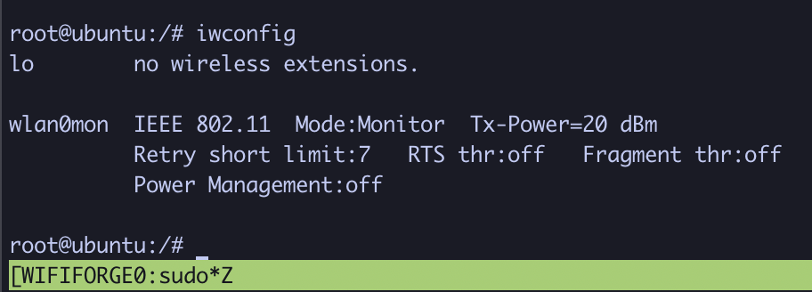
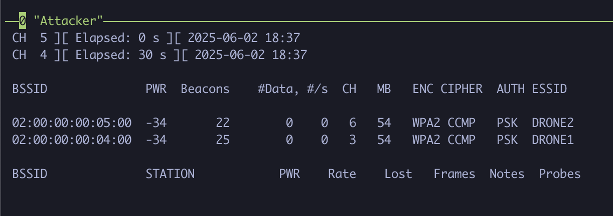
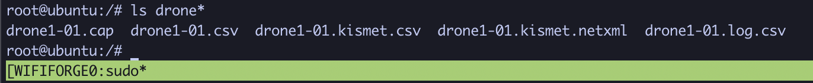
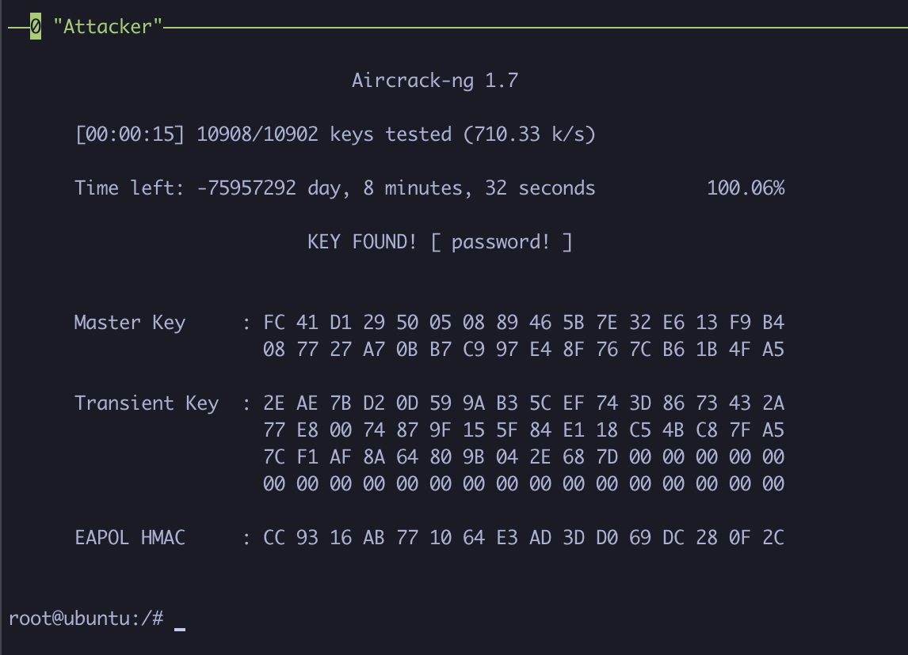
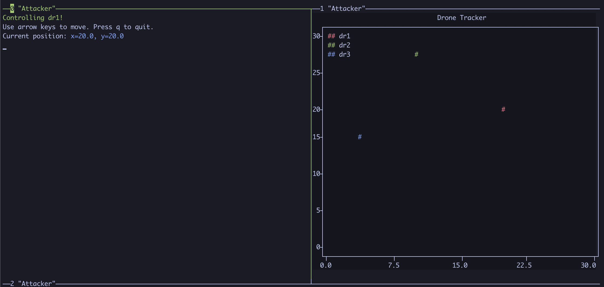

**Estimated Time:** ~45 min

## Summary
In this advanced lab, we will explore wireless drone hacking techniques. This lab teaches how to identify, attack, and take control of drones using WPA2 handshake capture and password cracking methods. You'll learn to monitor drone networks, perform deauthentication attacks, crack wireless passwords, and ultimately gain control of drone systems.

Select `Drone Hacking` from the WifiForge menu. Allow a few seconds to initialize the network.


Once complete, a tmux session will start with three panes.



Feel free to resize the panes by dragging the borders around. Start the graph that tracks drone positions by typing:

```bash
python3 WifiForge/framework/lab_materials/graph-drones.py
```


## Setting Up Monitor Mode
In another pane, set your wireless interface to monitor mode. First, identify the interface name by typing:

```bash
iwconfig
```

For this example, the interface name is `Attacker-wlan0`.



After noting the interface name, start monitor mode by typing:

```bash
airmon-ng start Attacker-wlan0
```

If prompted to automatically resolve any issues, type "y" and hit enter.


Verify the interface is now in monitor mode by running `iwconfig` again. The interface should be renamed to `wlan0mon`, and its `Mode:` should be set to `Monitor`.



## Scanning for Drone Networks
With the device in monitor mode, run the following to scan for nearby wireless networks:

```bash
airodump-ng wlan0mon
```



We can see two drones are active, each with its own dedicated network. For demonstrative purposes, we'll target the `DRONE1` network and attempt to capture its WPA2 handshake. To focus on the target network specifically, note the channel number and the BSSID of the device. In the case of `DRONE1`, we have the following:

- **Channel number**: `3`
- **BSSID**: `02:00:00:00:04:00`

Type `ctrl+c` to kill the current `airodump-ng` instance and type the following command, where:

- `-c` specifies the channel
- `--bssid` specifies the BSSID of the device
- `-w` outputs the capture to a file, called `drone1` in our case

```bash
airodump-ng wlan0mon -c 3 --bssid 02:00:00:00:04:00 -w drone1
```


We can also see that a client (station) device is actively connected to the network with the MAC address of `00:00:00:00:00:01`!

## Performing Deauthentication Attack
In the third pane, we'll launch a deauthentication attack on the `DRONE1` network. This will force the client to reauthenticate, initiating the four-way WPA2 handshake, which we can capture to later crack the password.

Type the following command, where:

- `--deauth 0` indicates deauthentication frames will be sent with no limit (0)
- `-a` is the access point MAC address (BSSID)
- `-c` is the client (station) MAC address

```bash
aireplay-ng wlan0mon --deauth 0 -a 02:00:00:00:04:00 -c 00:00:00:00:00:01
```


When you see `WPA handshake: <MAC_address>` appear in the `airodump-ng` window, stop both the deauth attack and capture process by pressing `ctrl+C` in their respective panes.


## Cracking the WPA2 Password
Now let's crack the WPA2 password! First, ensure that a capture file (`.cap`) was created.



If you have the `.cap` file, use `aircrack-ng` with a wordlist to attempt password recovery:

```bash
aircrack-ng -w /WifiForge/framework/lab_materials/rockyou.txt ./<drone-file>.cap
```

Give it a little bit of time, and eventually the password should be revealed!



## Taking Control of the Drone
Now that we've recovered the password, let's control the compromised drone! To run the controller, type:

```bash
python3 /WifiForge/framework/lab_materials/control-drones.py
```

Each drone will be password protected, so make sure to select the drone that was successfully compromised. In our case, we compromised `DRONE1`, so we will select `dr1` and enter its password.


If successful, you should be greeted with a `Controlling <drone_name>!` message. Move the drone around with the arrow keys and watch the drone move around on the graph!




When done, press `q` to exit the drone controller, and repeat the steps to compromise the remaining drones.

## Lab Complete
Congratulations! You have successfully completed Lab 12. You now understand:
- Advanced wireless drone network reconnaissance and targeting
- WPA2 handshake capture against mobile/drone networks
- Deauthentication attacks for forcing reauthentication
- Password cracking for drone network access
- Remote drone control through compromised wireless networks
- Multi-target wireless attack scenarios

This completes all the labs in this series. Please return to the main menu using the main_menu command before leaving.

---
**PREVIOUS LAB:** [Lab 11 - WEP Key Cracking](Lab%2011%20-%20WEP%20Key%20Cracking.md) 